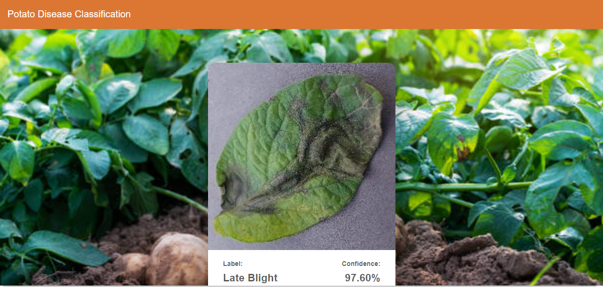

# Potato Disease Classification Project



This project aims to classify the health status of potato leaves into three categories: healthy, late blight, and early blight. It involves training a machine learning model, creating a local website for interaction, and deploying the model to perform real-time predictions on uploaded images.

## Table of Contents
- [Introduction](#introduction)
- [Dataset](#dataset)
- [Model Training](#model-training)
- [Local Website](#local-website)
- [Model Deployment](#model-deployment)
- [Usage](#usage)
)

## Introduction
Potato cultivation is susceptible to various diseases that can significantly affect crop yield. The ability to accurately classify these diseases using machine learning can help farmers take timely actions to mitigate crop damage. This project utilizes a trained model to classify potato leaves into different disease categories.

## Dataset
The model was trained on the dataset PlantVillage containing labeled images of potato leaves with three classes: healthy, late blight, and early blight. The dataset was preprocessed and split into training and validation sets to train the model effectively.

## Model Training
The machine learning model was developed using Python and popular deep learning libraries such as TensorFlow and Keras. The model was trained on the dataset to achieve high accuracy in classifying potato leaf diseases.

## Local Website
To interact with the trained model, a local website was created using Node.js, HTML, CSS, and JavaScript. Follow these steps to set up the website:

1. Install Node.js version 16.0.0 and npm version 8.6.0.
2. Navigate to the `frontend` directory using the command line.
3. Run the following commands:
   ```sh
   npm install --from-lock-json
   npm audit fix
   ```
4. Copy .env.example as .env and change the API URL in the .env file to the appropriate value.
## Model Deployment (FastAPI API)
The trained model was integrated into a FastAPI API for real-time predictions. Here's how to set it up:

1. Install the required Python packages:
   fastapi==0.70.0
uvicorn==0.15.0
numpy==1.21.1
Pillow==8.2.0
tensorflow
h5py
2. Open the api.py script in your preferred code editor.
3.Make sure to update the MODEL variable with the correct path to your trained model file(my_model.h5).
## Usage
1. Clone this repository to your local machine.
2. Follow the steps outlined in the "Local Website" and "Model Deployment (FastAPI API)" sections to set up the website and API.
3. Run the website using npm start in the frontend directory.
4. Open a web browser and access the website.
5. Run the api.py script to start the server.
6. Use the website to upload an image of a potato leaf.
The website will display the predicted disease category (healthy, late blight, or early blight) along with a confidence score.
